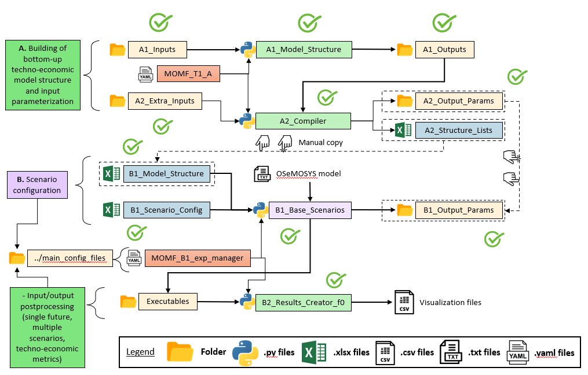

Getting Started
==================
Firstly, it is important take in count the workflow could
you see in the Figure `Structure Tier 1`. This workflow
indicates us which are the files important to make
execution of each step, and to see all workflow and
take a better comprenhension.

.. t1_workflow:

Example
-------
In this example works with data of a Costa Rica
model are avaible in the a `GitHub repository 
<insert repository link here>`__

Create Model Structure
^^^^^^^^^^^^^^^^^^^^^^
The first step of the MOMF is create the model
structure, for that you need to execute the
python script `A1_Model_Structure`. To could
make that execution you need to make a parametrization
the excel files: `A-I_Classifier_Modes_Demand`, 
`A-I_Classifier_Modes_Supply`, 
`A-I_Classifier_Modes_Transport` and
`A-I_Horizon_Configuration` onto `A1_Inputs`,
also you need adapt the yaml file `MOMF_T1_A`
to the model.

Then you need to execute the python script
`A1_Model_Structure`. When the execution
finish have been create some files:
`A-O_AR_Model_Base_Year.xlsx`,
`A-O_AR_Projections.xlsx`, `A-O_Demand.xlsx`,
`A-O_Fleet.xlsx`, `A-O_Parametrization.xlsx`
and `A-O_Fleet_Groups.pickle` onto `A1_Outputs`
; and this files are rewrite with the default
structure each time than you execute the python
script, so is recomendate only run this python
script one time.

.. code-block:: bash

    t1_confection                                 # Main folder of MOMF Tier 1
    ├── A1_Inputs                                 # Folder with input data to
    │   ├── A-I_Classifier_Modes_Demand.xlsx      # create structure model  
    │   ├── A-I_Classifier_Modes_Supply.xlsx         
    │   ├── A-I_Classifier_Modes_Transport.xlsx
    │   ├── A-I_Horizon_Configuration.xlsx
    │   ├── A-I_Readme.txt                        # Description of each excel file    
    ├── A1_Outputs  
    │   ├── A-O_AR_Model_Base_Year.xlsx         
    │   ├── A-O_AR_Projections.xlsx
    │   ├── A-O_Demand.xlsx
    │   ├── A-O_Fleet.xlsx
    │   ├── A-O_Parametrization.xlsx
    │   ├── A-O_Fleet_Groups.pickle               
    │   ├── A-O_Readme.txt                        # Description of each excel file  
    └── ...

+--------------------------------------------+--------------------------------------------------------------------------------------+
| File                                       | Description                                                                          |
+============================================+======================================================================================+
| ``A-I_Classifier_Modes_Demand.xlsx``       | Defines the sectors, energy vectors per sector, and complexity level for modeling    |
|                                            | demand.                                                                              |
+--------------------------------------------+--------------------------------------------------------------------------------------+
| ``A-I_Classifier_Modes_Supply.xlsx``       | Describes the production and transformation processes for each energy vector.        |
+--------------------------------------------+--------------------------------------------------------------------------------------+
| ``A-I_Classifier_Modes_Transport.xlsx``    | Structures the transport sector.                                                     |
+--------------------------------------------+--------------------------------------------------------------------------------------+
| ``A-I_Horizon_Configuration.xlsx``         | Contains the system model period.                                                    |
+--------------------------------------------+--------------------------------------------------------------------------------------+
| ``A-O_AR_Model_Base_Year.xlsx``            | Activity ratio for the base year.                                                    |
+--------------------------------------------+--------------------------------------------------------------------------------------+
| ``A-O_AR_Projections.xlsx``                | Activity ratio projections.                                                          |
+--------------------------------------------+--------------------------------------------------------------------------------------+
| ``A-O_Demand.xlsx``                        | Guidelines on performing demand projections.                                         |
+--------------------------------------------+--------------------------------------------------------------------------------------+
| ``A-O_Fleet.xlsx``                         | Defines the 2019 fleet according to MDHA.                                            |
+--------------------------------------------+--------------------------------------------------------------------------------------+
| ``A-O_Parametrization.xlsx``               | Provides tables for users to fill in data parameters.                                |
+--------------------------------------------+--------------------------------------------------------------------------------------+
| ``A-O_Fleet_Groups.pickle``                | Data on groups' fleet distribution.                                                  |
+--------------------------------------------+--------------------------------------------------------------------------------------+

Model Compiler
^^^^^^^^^^^^^^
The second step are define the process to make compilation of the
model into files by parameter. To make that take as inputs the
excel files into `A1_Outputs`, also the excel files into folder
`A2_Xtra_Inputs` and the file `A2_Structure_Lists`. After that,
is necessarily adapt the yaml file `MOMF_T1_A`, only the variables
use in the python script `A2_Compiler`. Then, execute this python
script. Moreover, is important to have in the folder 
`A2_Outputs_Params/Default`, because this one has the default files
by parameter whose uses by python script `A2_Compiler`.

This python script generate some files, in the folders `A1_Outputs`
and `A2_Outputs_Params`, in the second generate the same quantity
of folder than number of scenarios has the model and into this folders
are the excel files with data by parameter. The nex tree only has the
outputs files.

.. code-block:: bash

    t1_confection                                 # Main folder of MOMF Tier 1
    ├── A1_Outputs       
    │   ├── A-O_AR_Projections_COMPLETED.xlsx
    │   ├── A-O_Demand_COMPLETED.xlsx
    │   ├── A-O_Fleet_COMPLETED.xlsx
    │   ├── A-O_Parametrization_COMPLETED.xlsx
    │   ├── A-O_Fleet_Groups_Distance.pickle               
    │   ├── A-O_Fleet_Groups_OR.pickle 
    │   ├── A-O_Fleet_Groups_T2D.pickle 
    ├── A2_Output_Params  
    │   ├── BAU
    │   │   ├── excel files by parameter
    │   ├── NDP
    │   │   ├── excel files by parameter
    |   |   ├── Default
    |   │   │   ├── excel files by parameter
    |   ├── ...
    └── ...

+----------------------------------------+--------------------------------------------------------------------------------------+
| File                                   | Description                                                                          |
+========================================+======================================================================================+
| ``A-O_Parametrization_COMPLETED.xlsx`` | Provides tables for users to fill in data parameters after read.                     |
+----------------------------------------+--------------------------------------------------------------------------------------+
| ``A-O_Fleet_COMPLETED.xlsx``           | Defines the 2019 fleet according to MDHA after read.                                 |
+----------------------------------------+--------------------------------------------------------------------------------------+
| ``A-O_Demand_COMPLETED.xlsx``          | Guidelines on performing demand projectionsafter read.                               |
+----------------------------------------+--------------------------------------------------------------------------------------+
| ``A-O_AR_Projections_COMPLETED.xlsx``  | Activity ratio projectionsafter read.                                                |
+----------------------------------------+--------------------------------------------------------------------------------------+
| ``A-O_Fleet_Groups.pickle``            | Data on groups' fleet distribution.                                                  |
+----------------------------------------+--------------------------------------------------------------------------------------+
| ``A-O_Fleet_Groups_Distance.pickle``   | Data of distance by transport technologies.                                          |
+----------------------------------------+--------------------------------------------------------------------------------------+
| ``A-O_Fleet_Groups_OR.pickle``         | Data of Output Activity Ratio by transport groups technologies.                      |
+----------------------------------------+--------------------------------------------------------------------------------------+
| ``A-O_Fleet_Groups_TD2.pickle``        | Data with relation between technologies and fuels of transport.                      |
+----------------------------------------+--------------------------------------------------------------------------------------+
| ``excel files by parameter``           | Are excel files with data by each parameter of OSeMOSYS define by the model.         |
+----------------------------------------+--------------------------------------------------------------------------------------+

Create Input File
^^^^^^^^^^^^^^^^^
The next step is longer than other and also you need to be
carefully and is important follow the workflow in th picture
at the beginnig of the section. First, you go to the folder
`B1_Output_Params` and delete any folder you found here.
Now, go to the folder `A2_Outputs_Params` and copy folders
whose has scenario name and go to the folder `B1_Output_Params`
and paste these folders. Also you need to make manual copy
of the data from the file `A2_Structure_Lists.xlsx` to the
file `B1_Model_Structure`.

Then, ypu must do the parametrization of the model in the
files `B1_Scenario_Config,xslx` and `MOMF_B1_exp_manager.yaml`.
In the last yaml file mention use use for some scripts, for
this reason each variable have a flag to indicate in what
scripts it is use, except the two sections in the final of
the file, the variables below each section correspond to the
script metion in the section head, the name of the sections
are these: `# Parameters to script create_csv_concatenate.py`
and `# Parameters to script change_default_vals_params.py `.

In the next table are detail the most important variables
in the yaml file for the script:

.. warning:: 
    Only change the value not the name. If you change the name the execution of the script
    fail.

+--------------------------------------------------+----------------------------------------------------------------------------------------+
| Variable                                         | Description                                                                            |
+==================================================+========================================================================================+
| ``solver``                                       | Specify the solver to use. Options include 'glpk', 'cbc', or 'cplex'.                  |
+--------------------------------------------------+----------------------------------------------------------------------------------------+
| ``glpk_option``                                  | Choose the method for data postprocessing: 'old' uses MOMF's version, 'new' uses       |
|                                                  | otoole's version.                                                                      |
+--------------------------------------------------+----------------------------------------------------------------------------------------+
| ``del_files``                                    | Decide whether to delete intermediate files. Options: 'True' or 'False'.               |
+--------------------------------------------------+----------------------------------------------------------------------------------------+
| ``max_x_per_iter``                               | Specify the number of cases to run per iteration, based on the total scenarios.        |
|                                                  | Recommended range: 1-2; maximum should match the total number of scenarios.            |
+--------------------------------------------------+----------------------------------------------------------------------------------------+
| ``generator_or_executor``                        | Choose the process type: 'None' for calculations only, 'Generator' to write input      |
|                                                  | files, 'Executor' to run input files, or 'Both' for all processes.                     |
+--------------------------------------------------+----------------------------------------------------------------------------------------+
| ``coun_initial``                                 | Enter the initial for the study region, e.g., 'CR' for Costa Rica.                     |
+--------------------------------------------------+----------------------------------------------------------------------------------------+
| ``disc_rate``                                    | Enter the discount rate value, e.g., 0.00504.                                          |
+--------------------------------------------------+----------------------------------------------------------------------------------------+
| ``Use_Waste_B1``                                 | Toggle the waste module on or off. Options: 'True' or 'False'.                         |
+--------------------------------------------------+----------------------------------------------------------------------------------------+
| ``Use_Transport_B1``                             | Toggle the main transport module on or off. Options: 'True' or 'False'.                |
+--------------------------------------------------+----------------------------------------------------------------------------------------+
| ``NDP``                                          | Specify the name of the second scenario. Limit to 3 words.                             |
+--------------------------------------------------+----------------------------------------------------------------------------------------+
| ``year_apply_discount_rate``                     | Specify the year to apply the discount rate.                                           |
+--------------------------------------------------+----------------------------------------------------------------------------------------+
| ``change_year_B1``                               | Specify the year to make changes in the fleet.                                         |
+--------------------------------------------------+----------------------------------------------------------------------------------------+
| ``final_year``                                   | Enter the final year of the model.                                                     |
+--------------------------------------------------+----------------------------------------------------------------------------------------+
| ``default_val_params``                           | This dictionary should contain default values for every OSeMOSYS parameter available   |
|                                                  | in MOMF. Ensure the value of `DiscountRate` matches that of `disc_rate`.               |
+--------------------------------------------------+----------------------------------------------------------------------------------------+
| ``params_inputs_data``                           | This list should include every OSeMOSYS parameter available in MOMF. Comment out       |
|                                                  | unused parameters with `#`.                                                            |
+--------------------------------------------------+----------------------------------------------------------------------------------------+
| ``params_inputs_data_excep_by_scen``             | This dictionary holds a list for each model scenario, containing                       |
|                                                  | names of parameters exclusive to that scenario. Parameters can appear                  |
|                                                  | in multiple lists. If defined here, comment them out in the                            |
|                                                  | `params_inputs_data` list.                                                             |
+--------------------------------------------------+----------------------------------------------------------------------------------------+

.. tip::
    The variable ``generator_or_executor`` indicates what process you want to realize. The options are:
    
    - 'None': to only make the calculations.
    - 'Generator': to make the calculations and write the input files.
    - 'Executor': to make the calculations and execute the input files.
    - 'Both': to manage the processes of the previous options.

In the next tree you see the ubication of each file.

.. code-block:: bash

    osemosys_momf                                     # Main folder of MOMF repository
    ├── t1_confection                                 # Main folder of MOMF Tier 1
    |    ├── B1_Output_Params                         # Folder with outputs of the
    |    │   ├── BAU                                  # B1_Base_Scenarios_Adj_Parallel.py
    |    │   │   ├── excel files by parameter
    |    │   ├── NDP
    |    │   │   ├── excel files by parameter
    |    ├── A2_Output_Params                         # Folder with outputs of the A2_Compiler.py
    |    │   ├── BAU
    |    │   │   ├── excel files by parameter
    |    │   ├── NDP
    |    │   │   ├── excel files by parameter
    |    |   ├── Default
    |    │   │   ├── excel files by parameter
    |    ├── A2_Structure_Lists.xlsx
    |    ├── B1_Model_Structure.xlsx
    |    ├── B1_Scenario_Config.xlsx
    |    ├── Executables                              # Folder with outputs of the 
    |    │   ├── BAU_0                                # B1_Base_Scenarios_Adj_Parallel.py
    |    │   │   ├── BAU_0.txt
    |    │   │   ├── BAU_0_Input.csv
    |    │   │   ├── BAU_0_Output.csv        
    |    │   ├── NDP_0
    |    │   │   ├── NDP_0.txt
    |    │   │   ├── NDP_0_Input.csv
    |    │   │   ├── NDP_0_Output.csv
    |    |   ├── ...
    |    ├── A2_Compiler.py
    |    ├── B1_Base_Scenarios_Adj_Parallel.py
    |    ├── ...
    ├── config_main_files                             # Folder with config files and otoole configuration
    |    ├── MOMF_B1_exp_manager.yaml
    |    ├── ...
    ├── config_plots                                  # Folder with scripts to make inputs test and
    |    ├── create_csv_concatenate.py                # concatenate each output file by otoole
    |    ├── test_inputs.py
    |    ├── ...
    └── ...

Hablar de ejecutar en generador para generar los test de entrada

Tambien se puede correr en both

Execution Model
^^^^^^^^^^^^^^^

Hablar de correrlo en ejecutor o both

Comparison Models
^^^^^^^^^^^^^^^^^

Visualization
^^^^^^^^^^^^^
