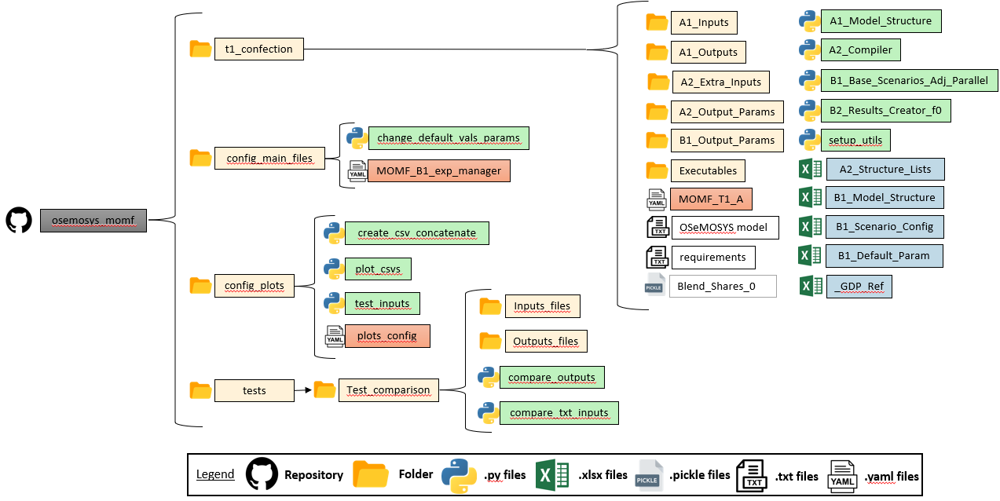

.. _welcome:

===========================================
Welcome to **MOMF** Documentation!
===========================================

Is energy system modeling tools that identify features of a robust
energy policy: a policy that performs well relative to alternatives. The
tools are based on the Open Souce Modeling System (OSeMOSYS), are named
the **M**\ ultipurpose **O**\ Se **M**\ OSYS-based **F**\ ramework (MOMF).

The MOMF can support energy decarbonization planning exercises, and it
is suitable to address the uncertainty involved in a decadeslong
process. It compares possible NDP futures -quantitative combinations of
uncertainties and sectoral policy objectives- to a business-as-usual
(BAU) scenario without decarbonization. The MOMF also evaluates actors
within a country, including the fiscal impacts of decarbonization,
following the best practices of applied energy modeling for policy
support.

.. momf_folder_struc:

Currently, ``MOMF`` exclusively accommodates the GNU MathProg variant of OSeMOSYS.

Contents
========

.. toctree::
   :maxdepth: 2

   Installation <_sections/install>
   Getting Started <_sections/gettingstart>
   
   License <_sections/license>
   Authors <_sections/authors>

Indices and tables
==================

* :ref:`genindex`
* :ref:`search`
.. * :ref:`modindex`